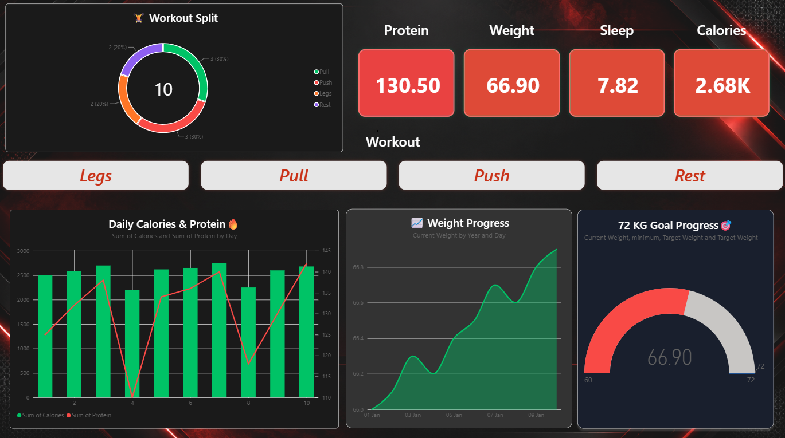

# 💪 FitTrack — Personal Fitness Analytics Dashboard

An interactive fitness analytics dashboard built using Microsoft Power BI and DAX.

## 📊 Dashboard Overview

FitTrack provides a visual overview of personal fitness and wellness data, including:

- Current weight and weight progression
- Daily calorie intake
- Protein consumption
- Sleep duration
- Workout split
- Progress toward a target weight
- Interactive workout filtering

## 🛠️ Tools & Technologies

- Microsoft Power BI
- DAX
- Excel
- Data Visualization
- Interactive Dashboard Design

## 📈 Key Features

### KPI Cards
Displays current weight, calories, protein intake, and sleep duration.

### Workout Analysis
Interactive Push / Pull / Legs / Rest filtering using Power BI slicers.

### Weight Progress
Tracks weight changes over time using a line chart.

### Nutrition Analysis
Compares daily calories and protein using a combination chart.

### Goal Tracking
Tracks progress toward a 72 kg target using a Power BI gauge.

## 🎯 Objective

The goal of the project was to transform raw fitness tracking data into an interactive dashboard that makes personal fitness trends easier to understand and analyze.

## 📷 Dashboard Preview

